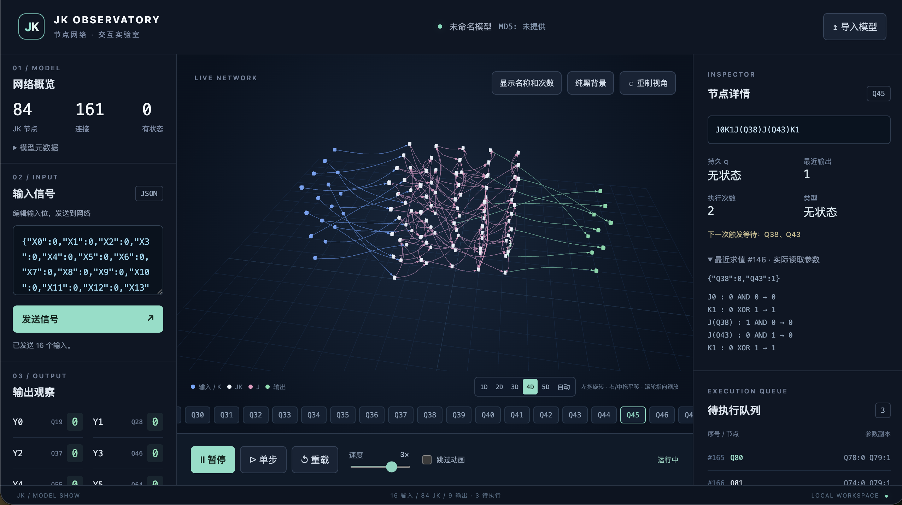
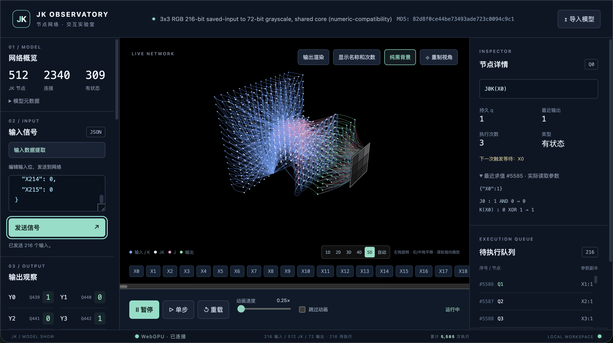

# 当前项目是JK节点网络模型3D展示的渲染游戏（ModelShow 提供的是 JK 执行和展示）V2


## JK 节点：

### JK 节点状态有两种：节点类型的判定依据：以 initial_q 为准

- 有状态节点：该节点始终存储一位 bit 数据 q = 0/1，q 会在模型初始化时被赋值且计算 ex 序列后写回 q 被更新
- 无状态节点：该节点不存储数据。只计算 ex 序列，完成后发布结果，不保存为下一次执行的起始状态。

### JK 节点有四种操作标识：
- `J0`: 置0
- `J1`: 保持
- `K0`: 保持
- `K1`: 翻转

### 操作标识会按顺序组合表达出 ex 计算序列在 JK 节点中：

#### 表达组合逻辑 ex：

- `Jx`: `q AND x`
- `Kx`: `q XOR x`
- `q = 0 = J0`
- `q = 1 = J0K1`
- `NAND(a,b) = J0K1J(a)J(b)K1`
- `NOR(a,b)  = J0K1K(a)J(b)K1K(a)`

- 只支持 J0、J1、K0、K1、J(X编号)、K(X编号)、J(Q编号)、K(Q编号)，按顺序拼接；允许忽略空白，不允许嵌套表达式，空表达式和未识别字符均报错。解析器必须消费完整字符串，不能只提取其中合法的片段继续计算。

#### ex 计算序列触发事件：
- 当前节点的任一`无状态节点的参数`到达时都先保存更新该节点对应的临时参数(覆盖最新值)（如有）。一次到达同时满足多处相同引用。所有临时参数都持续保留，直到到齐`触发执行`。
- 一次发布对同一目标只投递一次来源事件，同时满足多处引用；多条展示线不能额外增加执行次数，
- 当前节点的任一参数到达时都检测是否还有任一`无状态节点的参数`未到达，只有没有的时候才`触发执行` ex 计算序列求值。
- 当前节点没有`无状态节点的参数`每次参数事件都`触发执行` ex 计算序列求值，包括值未变化的事件，
- 当前节点只包含常量就只在初始化时执行
- ex 序列中无状态来源参数读取当前队列项保存的不可变副本；有状态来源参数在执行时读取其当前 q 值（沿线携带的值未必等于最终参与运算的值）。
- 无状态 JK 节点的 ex 必须以 J0 开头，否则标记异常并禁止执行。输入节点不受此限制。

#### 逻辑执行顺序 - `执行队列`

- `执行队列`中的节点都是`触发执行`且未执行的待执行节点，每执行完一个节点后就传递计算后的值到所有引用该值的节点，就会产生一批新的待执行节点按id编号大小排序后追加到队列尾，按队列顺序执行。
- 同一个节点如再次满足`触发执行`可以重复入队。同一节点重复触发时，保留多次执行即多次入队
- 节点入队后复制所有`无状态节点的参数`的到达值，且无法被修改，清空该节点保存的所有`无状态节点的参数`临时参数（如有）
- 当执行该节点时，才读取有状态节点 q 值（如有）
- 取出队首 → 读取参数并计算 → 写回有状态节点的 q → 向引用节点投递结果 → 将新触发项按节点编号数值排序追加到队尾。
- 单个队列项的计算、写回和结果投递不可被新输入打断；发送操作在两个队列项之间处理。
- 显示完整的`执行队列`列表及 当前队列长度
- 显示累计所有节点执行总次数。每个节点旁边显示该节点的执行次数。

## 模型渲染：

### JK 网络模型 JSON 格式：
```json
{
  "name": "对当前 JK 节点组的描述",
  "md5": "e46627f52ca9a3974fddc75020b20ef0",
  "format": "jk-logic-structure-V3.1.0",
  "format_md5": "b1b11868c091bfa5e571935200467312",
  "created_at": "2026-08-22T04:1787372535000000000",
  "input_bits": 4,
  "jk_bits_max": 16,
  "jk_bits": 6,
  "output_bits": 4,
  "ex_source_max": 3,
  "ex_operation_max": 5,
  "ex_source_sum": 12,
  "ex_operation_sum": 23,
  "nodes": [
    {"id": "Q0", "ex": "J0K1J(X0)K1"},
    {"id": "Q1", "ex": "J0K1J(X1)K1"},
    {"id": "Q2", "ex": "J0K1J(Q0)J(Q1)K1"},
    {"id": "Q3", "ex": "J(X0)J(X2)K(Q0)"},
    {"id": "Q4", "ex": "J0K1J(Q2)K(X1)"},
    {"id": "Q5", "ex": "J(X3)J(Q1)K(Q3)"}
  ],
  "initial_q": {
    "0": [],
    "1": ["Q3", "Q5"]
  },
  "q_y": [
    {"Y0": "Q2"},
    {"Y1": "Q3"},
    {"Y2": "Q4"},
    {"Y3": "Q5"}
  ],
  "inputs": [
    {"X0": "X0"},
    {"X1": "X1"},
    {"X2": "X2"},
    {"X3": "X3"}
  ],
  "outputs": [
    {"Y0": "Y0"},
    {"Y1": "Y1"},
    {"Y2": "Y2"},
    {"Y3": "Y3"}
  ]
}
```
渲染只需解析 nodes、initial_q、q_y 三组数据，未引用输入不显示，其它数据只做展示

### 模型包含三类节点标记：

- 输入节点 `X0..Xn`
- JK 节点 `Q0..Qn`
- 输出节点 `Y0..Yn`

### 节点加载 和 3D 布局及动画

- 先建立所有节点和引用关系，赋值所有持久 q，再将常量节点按编号顺序加入执行队列。初始化加载 q 值，不发布事件
- 表达式无法解析、引用不存在、节点 ID 重复、初始化配置冲突等。同时明确异常节点保留展示但不执行，应展示出该节点异常提示；
- 异常来源不可参与有效求值；直接引用它的节点显示“依赖异常”并禁止执行，这种阻塞沿依赖关系传播。其他独立部分继续运行。重复 ID 也不能静默覆盖其中一个节点。应展示出该节点异常提示；
- 动画可无限运行，但是有全局暂停按钮；当节点执行次数高于 1000 时就标记该节点及所有相关边线为红色，红色提醒优先于普通节点和边线颜色。
- 一次点击发送时，按 X 编号数值顺序投递所有有效输入，完成后继续执行队列；新触发项仍追加队尾。这只是一次用户操作的处理边界，不需要增加请求分组语义。
- 输入数据 → `执行队列` → 3D 动画播放，3D 渲染动画依据`执行队列`逐步展示
- 如果`执行队列`清空但仍有节点等待参数，应展示等待状态；
- 输入节点发送出一组数据到对应引用节点，0/1 数值会沿边线跟在箭头后移动。JK 节点 ex 序列计算后的值也会沿边线跟在箭头后移动到被引用的下一级节点。
- 连续点击发送前一次未完成时，新输入允许交错（无需等待现有执行队列清空即可发送）
- 输出节点收到来源发布值时更新最近输出并记录展示，不进入执行队列；尚未收到值时显示“未输出”。
- 完整执行队列列表使用虚拟滚动，动画历史采用有限缓存，避免长时间运行拖慢界面。
- 每完成一个队列项，播放其传播动画，动画完成后才推进下一项；输入仍可在允许的执行边界投递。到达动画只展示已经记录的事件，不能再次触发求值。单步完成一项后保持暂停，暂停状态下发送输入不自动恢复运行。
- 输入在左侧、JK 节点在中间、输出在右侧；提供 1D / 2D / 3D / 4D / 5D / 自动布局，每次加载模型默认 4D 拓扑布局，具体规则见“网络布局档位”。支持整体旋转缩放，选中节点高亮其关联边。自环使用弧线，重复边分离显示；不支持单独拖动节点。

动画消费同一份记录。拖拽、倍速、视角变化只影响展示。记录至少能说明来源、目标、传输值，以及节点求值前后的状态。
有且只有`执行队列`，没有轮次、批次、组次、跨请求等概念逻辑

#### 网络节点布局档位：1D / 2D / 3D / 4D / 5D / 自动（默认为4D拓扑结构）

- 2D～5D 中，输入、JK、输出节点的布局交换原 Y/Z 坐标，再翻转 Y 坐标的正负，X 坐标保持不变；1D 保留沿 Y 轴从上到下的竖排。画板自身的行列方向保持不变。
- 1D显示的是输入节点一列，JK节点一列，输出节点一列，各列按编号沿 Y 轴从上到下排列，Z 为 0。
- 2D显示的是三种节点各一个 YZ 平面（近似正方形平面），按编号先沿 Z 轴负方向填充，再沿 Y 轴负方向从上到下换行，中心轴都是 X 轴方向。
- 3D显示的是 2D + JK 节点按 Z、X、Y 的填充顺序排列，沿 Y 轴负方向从上到下换层（近似正方体）。
- 4D显示的是 2D + JK 节点是 XYZ 轴方式的拓扑结构排列。
- 5D显示的是 4D + JK 节点中有引用输入节点参数的 JK 节点排列在靠近输入节点方向的第一排，而有被输出节点引用的 JK 节点排列在靠近输出节点方向的第一排，其它节点以球形的方式向外扩张布局在该节点总引用的节点距离最短的位置上。

### 边线来源：

- 解析 nodes[].ex 中的每个非常量 J/K token，生成 source -> node.id（重复来源会产生重叠线）
- 解析 q_y 中的每个 {Yi: Qj}，生成 Qj -> Yi
- 常量 0/1 不创建独立节点或连线
- X 来自表达式引用、Q 来自 nodes、Y 来自 q_y，其他字段只展示。

### 颜色要求：

- 输入节点 `X*`：蓝色
- JK 节点 `Q*`：白色
- `initial_q` 中需要保存 q 的 JK 状态节点：有 q 字母在节点中心
- 输出节点 `Y*`：绿色
- 输出节点的连线及箭头：绿色
- J 操作线及箭头：粉色
- K 操作线及箭头：蓝色


## 操作功能：

### 输入节点数据 JSON

```json
{"X0": 1, "X1": 0, "X2": 1, "X3": 0}
```

#### 缺失输入或未匹配到的输入节点数据，输入节点是无状态节点类型，不参与本次发送

- 已匹配输入的值必须为数字 0 或 1；出现非法值时提示错误，本次发送不投递任何输入。

### 发送按钮、跳过动画、暂停按钮、`执行队列`单节点步进执行、执行速度（调节滑块）、重载

- 暂停：停止取出下一队列项，同时暂停动画。
- 单步：完成一个队列项的计算、写回和投递。
- 跳过动画：省略传播展示，按每帧时间预算串行执行多个 FIFO 队列项；计算触发的新项立即追加队尾，界面在帧尾统一刷新，仍能响应暂停。
- 速度滑块：普通模式显示“动画速度”，控制传播动画；跳过模式显示“计算速度”，每帧计算预算为 `4 ms × 倍速`。0.25×、1×、4× 分别对应 1、4、16 ms；切换模式保留倍速，并显示当前预算。高倍速可能降低画面流畅度。
- 重载：清空队列、参数缓存、输出、计数与动画记录，重新初始化。


## 项目最有价值的体验，是让用户能从信号流动追溯到“这个节点为什么在此刻执行、为什么得到这个值”。


## 优先完成：

- 模型导入、旋转缩放、节点选择和视角复位；
- 输入发送、暂停、步进执行、倍速和重置；
- 节点详情：ex、持久 q、最近输出、等待参数；
- 当前事件与输出列表。


## 实现时再覆盖这几项测试：

- 同一节点重复入队，各队列项参数互不覆盖。
- 部分输入持续等待，补齐后触发。
- 有状态来源在执行时读取最新 q。
- 暂停、单步、跳过动画保持相同执行顺序。
- 非法输入整次不投递；重载恢复初始状态。


## 浏览器 Three.js + WebGPU/WebGPURenderer 渲染

- 
- 浏览器无法初始化 WebGPU 时，提示“当前环境无法使用 WebGPU”，

## 首版运行与实现说明

已实现为本地浏览器应用，使用 JavaScript ES modules、Three.js 0.180.0 的 WebGPURenderer 和 Vite。所有运行资源随本项目依赖打包，不使用远程 CDN、字体或后端服务。模型文件只在浏览器本地读取。

### 启动

```sh
# 初次安装依赖（Node.js 22.12+，已安装依赖可跳过）
pnpm install

# 开发服务，仅监听本机
./dev.sh

# 逻辑与播放控制测试
./dev.sh test

# 生产构建及预览
./dev.sh build
./dev.sh preview
```

打开终端打印的本地地址，默认 http://127.0.0.1:5173/ 。`dev.sh` 优先使用系统 Node.js，没有时可使用当前 Codex 自带的 Node.js；也可用 `npm run dev`、`npm test`、`npm run build` 执行相应脚本。浏览器必须支持 WebGPU，应用不自动回退 WebGL；GPU 不可用时显示提示，逻辑调试面板仍可使用。

### 操作约定

- 默认加载 `public/example.json`，可点击“导入模型”选择本地 JSON 文件，或直接录入、粘贴完整模型 JSON 后点击“导入 JSON”。模型名称后显示文件中的 MD5；未提供时显示“未提供”。文件结构或 JSON 解析失败时保留原模型；节点级错误保留展示并阻止异常依赖执行。
- 初始自动播放开启，但没有输入和常量节点时不会自行求值。暂停后发送输入只更新缓存及队列，不恢复执行。
- 单步跳过此前未完成的展示动画，再执行一个队列项，保持暂停；该步的传播值显示在边线终点。动画从不重新投递逻辑事件。
- 跳过模式的预算包含节点计算、逐项通知和 Yi 聚合开销，只在两个完整执行项之间检查；单项计算不打断，耗时较长时可超过预算。每帧另设最多 10,000 次执行的保护上限，耗尽预算后从剩余队首继续。队列为空、模式切换、暂停、异常或达到原队列保护阈值时停止批量执行；暂停后开启跳过也不会自行运行。
- 开启跳过立即清除未播放的展示记录，不重发输入、不重放传播事件；跳过模式下发送信号不再排入展示记录。关闭跳过后，仅对后续执行项恢复普通动画。各项状态与输出仍立即更新，节点不会因结果相同而省略执行。相同初始状态和相同输入事件交错位置保持相同执行顺序；运行中再次手动发送信号时，由于计算速度改变，信号与已有计算的交错位置可能不同。
- 拖动空白场景旋转，滚轮缩放；点击球体或下方节点按钮查看详情。首版不提供单独拖动节点或修改拓扑。
- 节点编号使用非负十进制整数，不接受前导零；同一来源的重复操作引用有分离的展示线，但只有一次逻辑投递。
- 全局队列达到 10,000 项时停止自动执行并拒绝新输入，可单步或重载。一个原子投递步骤允许超过阈值，已触发的执行项不截断、不丢弃。
- 历史记录最多保留 400 条，面板显示最近 60 条；完整待执行队列使用虚拟滚动。普通动画模式的待播放输入记录达到 400 条时拒绝新发送，提示先播放或跳过；跳过模式不受展示记录数量限制，仍遵守逻辑队列保护。历史裁剪不改变逻辑队列或参数缓存。
- 节点执行次数高于 1,000 的红色标记只表示执行次数高，不代表已经证明存在循环。

### 示例验收

重载示例后发送 `{"X0":1,"X1":0,"X2":1,"X3":0}`，依次执行 `Q0 → Q1 → Q3 → Q2 → Q5 → Q4`，发布值依次为 `0、1、1、1、1、1`，最终 `Y0、Y1、Y2、Y3` 均为 `1`。重载后处于暂停状态，需要单步或点击继续。

### 代码职责

- `src/engine.js`：完整表达式解析、模型校验、依赖异常传播、FIFO 执行器与有限历史记录。
- `src/playback.js`：暂停、单步、倍速、跳过动画及输入展示调度。
- `src/frame-updates.js`：逐项同步数据通知与帧尾界面刷新合并。跳过批量的时钟、基础预算和每帧执行上限可注入测试，默认使用单调时钟、4 ms 基础预算及 10,000 项上限。
- `src/network-batches.js` / `src/node-labels.js`：节点、连线、箭头的批量绘制，以及共享字形图集。
- `src/render-schedule.js`：独立控制场景提交频率、暂停后的按需绘制和隐藏页面的风动时钟；不调度 JK 计算。
- `src/view.js`：WebGPU 场景、空间布局、选择、连线、箭头与传播值动画。
- `src/main.js` / `src/style.css`：导入、输入输出、节点详情、队列与响应式界面。
- `tests/engine.test.js`：真值表、队列副本、读取时机、反馈、异常、重载及播放控制回归。

当前实现尚未给出大规模节点数量或特定硬件帧率保证；需要使用目标模型进一步测量。

### 渲染开销与帧率

节点数量不能单独代表渲染负载：每条引用还有浮动曲线、箭头和可能的选中加粗效果，节点名称、次数及传播值也需要绘制。总引用数量、可见文字、窗口像素数、设备像素比和同时变化的内容都会影响 CPU/GPU 开销。节点方块很小，并不代表浏览器处理和提交这些对象的成本也很小。

场景绘制与计算调度分开：只有缓慢风动时，GPU 提交目标为每秒 30 帧；旋转、平移、缩放或正在播放传播动画时，目标提高到每秒 60 帧。暂停且场景没有变化时停止重复提交，有选择、布局、画板或相机变化时重新绘制。目标帧率是上限目标，实际帧率仍取决于硬件与模型。高刷新率显示器不会无条件按其最高刷新率反复绘制同一场景。

跳过动画的 FIFO 时间预算、逐项计算和帧尾界面更新仍由原调度驱动，降低场景提交频率不会合并、跳过或重排计算事件。页面进入后台时不提交 3D 画面，并冻结风动计时；返回前台后不追赶后台经过的风动时间。暂停仍停止连线起伏。`tests/render-schedule.test.js` 验证不同显示刷新率下的提交数量、交互恢复、按需绘制及隐藏页面后的时间连续性。

运行 `./dev.sh` 后可打开 `/tests/render-benchmark.html` 做有界浏览器测量：768 个 JK、64 个 Xi、64 个 Yi，共 896 个节点和 3,136 条连线，保留全部名称与次数，不执行逻辑事件。预热后记录 120 次 RAF 回调，再验证暂停和渲染器恢复。2026-09-08 本机 WebGPU、1920×1280 绘图缓冲区下，合批前每帧 8,962 次绘制、1,794 张纹理，约 21 FPS；合批后每帧 6 次绘制、3 张纹理，达到设定的 30 FPS，暂停后的 60 次 RAF 中提交次数为 0。每次 RAF 内场景处理平均耗时约 32.6→4.1 ms（后者包含被帧率限制跳过的绘制回调）。这些是该测试场景的数据，不是系统 CPU/GPU 使用率或所有模型的帧率保证。

### 模型切换与渲染恢复

- 释放旧模型和动画时，只释放本组拥有的几何、材质与纹理，不释放 Three.js Sprite 全局共享的几何。否则新旧标签共用的 GPU 缓冲区可能失效，使画面停留在旧模型。
- 渲染错误或 GPU 设备丢失时暂停计算并显示“恢复 3D”按钮。恢复会重新建立渲染器，保留当前模型、队列、输出和计数；计算保持暂停。
- `tests/jk-logic-structure-v262.json` 已加入导入回归测试；`tests/resources.test.js` 验证共享 Sprite 几何不被释放、独立资源只释放一次。

### 场景外观

- 输入、JK 和输出节点统一使用边长 0.10 的实心小方块，不绘制光晕或选中外环；输入位于最左区域，输出位于最右区域，1D 为沿 Y 轴从上到下的单列、其余档位的输入输出为 YZ 平面，各自与 JK 区域至少间隔 3 个单位，不显示 INPUT/OUTPUT 字样。选中时高亮节点名称并加粗所有关联入边、出边；再次点击同一节点（包括底部节点按钮）或点击画布空白处取消选中。
- 边线箭头靠近目标方块表面，传播动画也在目标表面附近结束。
- 场景右上角“纯黑背景”按钮可切换黑色背景；开启时隐藏地面网格和雾效，关闭后恢复原背景。导入模型不改变该开关状态。

### 网络布局档位

画布底部操作提示前提供 `1D / 2D / 3D / 4D / 5D / 自动` 按钮，每次加载或导入模型默认选中 4D 拓扑布局；自动布局可手动选择，执行“重载”保留当前档位。1D 中三类节点各沿 Y 轴从上到下竖排，Z 为 0。2D～5D 中，输入、JK、输出三类节点交换原 Y/Z 坐标，再翻转 Y 坐标的正负，X 坐标保持不变；画板自身的行列方向保持不变。算法先按原规则完成排列和自动选档，再仅将 2D～5D 转换为 `{ x: 原x, y: -原z, z: 原y }`，自动选中 1D 时也保留沿 Y 轴的竖排。坐标转换不重新优化或改变自动档位选择。各档位仅改变节点位置，保留 q、待执行队列、暂停状态、动画进度、选中状态和既有连线样式。

| 档位 | 排列规则 |
| --- | --- |
| 1D | 输入、JK、输出各自只有一列，三列沿 X 轴由左到右排列；每列按编号沿 Y 轴从上到下，Z 为 0。 |
| 2D | 输入、JK、输出分别排成近似正方形的 YZ 平面网格，按编号先沿 Z 轴负方向填充，再沿 Y 轴负方向从上到下换行；各区分别保持 X 坐标固定，三个区域的几何中心沿 X 轴排列。 |
| 3D | 输入、输出与 2D 相同；JK 节点先沿 Z 轴负方向填充，再沿 X 轴正方向换列、Y 轴负方向从上到下换层，排成近似正方体。 |
| 4D | 输入、输出与 2D 相同；JK 在 XYZ 立方候选位置上按实际引用拓扑排列。 |
| 5D | 以 4D 的拓扑位置为初始参考；直接引用 Xi 的 JK 节点固定在输入侧第一排，被输出引用的 JK 节点固定在输出侧第一排；其余 JK 在球形候选位置上优化引用来源距离。 |
| 自动 | 对上述五个档位计算遮挡、交叉、连线长度等启发式评分，选择得分较低的布局。 |

三类区域之间至少保留 3 个单位空隙；网格候选位置步长为 1。2D～5D 的输入和输出都是垂直于 X 轴的 YZ 平面，不再强制为单列。各区以包围盒中心对齐 X 轴；节点数量不是平方数或立方数时，允许部分网格空缺。

4D 先将反馈环归并为强连通分量，计算依赖深度，再将节点按深度分配到立方网格中从左到右的 X 切片。同一个 X 切片内通过交换位置缩短实际总连线长度，重复引用和输出连线分别计入。不同依赖深度可以落在同一切片，不把长链强制展开成横向长条。反馈环完整保留。大切片采用有界邻域搜索，不保证全局最短。

5D 的第一排指垂直于 X 轴的单个 YZ 网格面，输入侧、输出侧分别处在其它 JK 候选位置的左、右边界之外。一个 JK 同时满足两侧条件时，按用户确认的规则优先放输入侧，不复制节点。其余节点使用整数格点球壳作为候选，按离球心距离从小到大展开，保留完整同半径球壳。先将 4D 位置映射到互不重复的球形候选位置，然后按非常量参数引用次数从多到少处理，平局按拓扑深度、编号排序。

每一步比较当前节点 ex 中所有实际引用来源的欧氏距离之和，重复引用分别计数，自引用距离为 0；同距离优先选择靠近球心的位置。若候选位置被尚未固定的节点占用，交换两者位置并按交换后的来源位置比较距离，最终固定当前节点。后续节点移动可能改变较早节点的引用距离，因此这是确定性的逐步局部优化，不是最终全局最优或真实计算时间优化。固定的两侧第一排不参与交换。

布局仍在 Web Worker 中计算，切换会终止旧任务，导入下一模型重新使用 4D 拓扑布局，执行“重载”保留当前档位。自动模式在超过 256 个 JK 节点时跳过成本较高的 5D，仍可手动选择。自动评分是布局计算坐标系中的启发式评估，在 2D～5D 交换 Y/Z 并翻转 Y 之前完成；它不保证当前相机方向下遮挡最少，旋转后遮挡情况也可能改变。

实现：`src/layout.js` 为纯位置算法，`src/layout-worker.js` 为后台入口。`tests/layout.test.js` 覆盖三列沿 Y 轴从上到下排列、各类 YZ 平面及填充方向、近似立方体、拓扑方向、5D 两侧边界与输入优先、球壳及逐步引用距离选择、运行状态不变性。

### 视角保持与连线弧度

左键拖动支持横向、纵向连续 360° 自由旋转，可以越过上下极点。右键、中键或 Shift+左键拖动平移画面，相机与旋转中心一起移动。滚轮围绕鼠标指向的位置缩放，并同步移动旋转中心：指向节点时以命中的节点表面为锚点，指向空白时以经过当前旋转中心的观察平面为锚点。左键单击选择或取消选择，旋转和平移拖动不会触发选择。

`src/editor-controls.js` 实现自由旋转和鼠标锚点缩放；`tests/editor-controls.test.js` 验证完整旋转、平移中心同步、缩放锚点投影不变及缩放范围。重制视角时恢复正向朝上，以布局中心为观察目标，从正前方略偏右的位置平视，GPU 恢复保留翻转后的方向。

首次打开采用初始视角，此后仅点击“重制视角”按钮才按当前布局重新适配相机。切换布局、重新导入模型不会修改相机位置、朝向或旋转中心；GPU 恢复也保留原视角。若新布局超出当前取景范围，可手动缩放或点击重制视角。

所有连线都有轻微弧度和各自独立的随机平滑起伏（主要随机目标之间以 15～25 秒平滑过渡，叠加沿线错开的缓慢风动，不逐帧抖动；长连线摆幅更大，最大单侧摆幅为 0.55 个单位，端点固定），起伏只改变边线，不移动节点，不触发计算。重复引用、反向连接按同一对端点统一分配不同弧线，自环使用不同半径。公共端点仍相接，任意视角下的投影交叉并不等同于整条边线重合。箭头、传播数值及选中加粗曲线跟随同一路径，暂停时起伏停止。曲线最多每秒更新 20 次并复用 GPU 缓冲区，实际更新次数受场景绘制频率约束。

`src/edge-curves.js` 管理曲线及缓冲区更新；`tests/view.test.js` 覆盖视角保持、端点固定、重复与反向边分离、自环及高亮同步。

节点统一使用边长 0.10 的实心方块。场景右上角“隐藏名称和次数”按钮同时切换输入、JK、输出节点的名称及执行次数；隐藏后按钮变为“显示名称和次数”。此设置在切换布局、导入模型及计算次数更新后继续生效，不影响右侧节点详情。

节点方块、边线与箭头使用持久缓冲区合批绘制；名称、次数及状态标记共享字形图集并在 GPU 上朝向相机。次数变化只更新对应文字的实例数据，不重新绘制或销毁纹理。节点拾取仍使用原位置的独立代理，选中相关连线继续显示加粗曲线。合批仅影响渲染，不修改模型、FIFO、节点数量或连接统计。


## 输出数据聚合渲染：
增加一个输出渲染功能按钮，能指定选择一些 Yi 节点的数据进行排列组合出一个十进制数值，然后根据一个二进制数据或者十进制数据值来在画板显示相应灯的RBG通道亮度，画板是由多个灯显示排列组成的，Yi 节点的数据改变画板也随之改变，就像显示屏一样。
画板显示在输出节点的右侧，一个或多个输出节点控制一个灯的RBG通道亮度，且有边线连接


场景工具栏“输出渲染”打开配置窗口。默认 4×4、关闭显示，支持 1～32 行和列，最多 1024 个灯；调整行列保留共同区域的逐灯设置。“画板大小（倍）”可将画板、灯及白色边框整体缩放为 0.25～8 倍，默认 1 倍，修改立即生效且不改变灯的行列数。勾选“显示画板”后，在输出节点世界 X 正方向至少留 3 个单位间隔，画板位于 YZ 平面、正面朝 +X（右侧）。画板采用极简平面风格：薄黑背板、镂空细白边框和平整 RGB 色块，灯色不受场景光照和雾影响；从正面看，灯按从左到右（Z 轴负方向）、从上到下（Y 轴负方向）编号。配置或布局变化不会修改相机；点击“重制视角”才将画板纳入取景。

- **独立通道**：R/G/B 各自选有序 Yi 列表，或固定 0～255 值。支持 Yi 添加、移除、上下移位；第一项默认最低位，可切换最高位。固定值可切换二进制/十进制输入，持久化为数字。
- **RGB 打包**：一串 Yi 按 R、G、B 顺序切段，各段独立位数（默认各 8 位），共用位序和换算方式。可无损转成独立通道；反向无损转换要求三通道都为 Yi 且位序/换算一致。不满足时可选择新的打包编辑模式重新填写，点击应用才覆盖原配置。
- **亮度**：每通道 1～64 位，BigInt 精确聚合；按位宽缩放使用 round(value×255/(2^n−1))，或直接取值并在 255 截断。同一 Yi 可复用到多个灯、多个通道，或在位列表中重复出现。
- **批量分配**：选择起始 Yi、每通道位数、位序与换算，按 Yi 数值编号顺序给灯分配连续可用输出；可选择同一组位复用成灰度。应用前显示所需/可用数量，不足时拒绝，不循环填充。异常输出可以绑定，但通道保持未就绪。
- **实时值**：窗口预览、灯详情显示列表顺序的位串、聚合十进制值、最终亮度。任何绑定位未输出、引用失效或输出异常，对应通道熄灭并列出原因，其它正常通道继续显示；缺失不算作 0。Yi 更新后直接组合最近值，不增加批次、锁存或计算事件。重载导致 Yi 清空时，动态通道回到未就绪，固定值通道保持配置亮度。
- **连接与选择**：每个 Yi/灯/通道显示一条通道色弧线，通道内重复位不重复画线。连线接入画板背面的 R/G/B 接点，缓慢浮动保持在背板后方；同一灯同一通道共用一个接点。点击正面色块可查看/编辑绑定并高亮连接，背板遮挡隐藏的灯，选中 Yi 也高亮关联灯线。画板不计入 JK 节点、逻辑连接和执行次数。
- **保存**：“导出模型及画板配置”下载完整 JSON，同时提供只读 JSON 文本供复制。保留模型其它字段和原 MD5，仅新增/更新可选 outputDisplay。旧模型没有该字段时关闭画板；更换模型不沿用旧绑定。非法配置单独报错并关闭画板，不妨碍合法 JK 模型执行。关闭显示保留配置，GPU 恢复保留画板及当前值。

outputDisplay v1 示例（一盏灯：Y0/Y1 控制红色，绿色固定 128，蓝色固定 0）：

```json
{
  "version": 1,
  "enabled": true,
  "rows": 1,
  "cols": 1,
  "scale": 1,
  "pixels": [{
    "mode": "channels",
    "channels": {
      "r": {"kind": "bits", "bits": ["Y0", "Y1"], "order": "lsb-first", "mapping": "scale"},
      "g": {"kind": "fixed", "value": 128},
      "b": {"kind": "fixed", "value": 0}
    }
  }]
}
```

打包灯的格式为 `{"mode":"packed","bits":["Y0","Y1","Y2"],"widths":{"r":1,"g":1,"b":1},"order":"lsb-first","mapping":"direct"}`。`order` 可选 lsb-first/msb-first，`mapping` 可选 scale/direct。pixels 长度必须等于 rows×cols。缺省独立通道为固定 0。`scale` 为 0.25～8 的有限数值，随配置导出和恢复；旧版 v1 配置未提供 `scale` 时按 1 倍显示。

实现由 `src/output-display.js`（纯聚合与校验）、`src/output-display-ui.js`（配置与预览）、`src/output-board.js`（批量灯阵及连接）组成。灯采用 InstancedMesh，连接按通道合批；只更新受变化 Yi 影响的灯颜色，弧线复用缓冲区、最多每秒更新 20 次，重配时释放旧资源。最大尺寸并不保证任意模型/硬件帧率，连接数量也取决于每个通道的引用数。

跳过模式下，每个执行项产生 Yi 发布后仍立即进行纯数据聚合，不等整批到齐；同一帧内多次受影响的灯累计到待绘制集合，帧尾按最终颜色绘制一次。重复同值发布不会产生无效改色，重载恢复未就绪，重新配置、导入模型和恢复 GPU 时同步保留正确的当前灯色。


## 图片像素提取与 Xi 输入：

输入信号区域的“输入数据提取”打开独立窗口。没有图片时直接选择本地文件；已有图片时恢复原图、选框和配置，可用“更换图片”重新导入。图片仅保留在当前页面会话，刷新后需要重新导入，不写入模型 JSON。

- **选框**：宽、高以原图像素计，默认 8×8，小图限制到实际尺寸；坐标以原图左上角为 (0, 0)。左键拖动选框，空格＋左拖或中键拖动平移图片，滚轮围绕鼠标缩放。“适应窗口”和“原始比例”分别调整显示比例。选区对齐整数像素且不会越出图片，可直接编辑 X/Y 坐标。显示缩放和平移不改变采样结果。
- **像素数据**：PNG、JPEG、WebP 使用浏览器解码后的原始分辨率 sRGB 数据，按解码朝向显示和取样；动画只取首帧（APNG 的独立静态封面不作为首帧）。原图保存在独立数据画布，预览的选框、网格和缩放不参与提取。
- **颜色**：默认 RGB 8 位，每像素 24 位；可选灰度 8 位，每像素 8 位。透明底色可选白色（默认）或黑色，各通道先计算 `round((通道值×Alpha + 底色值×(255−Alpha))/255)`，再按 `round((299R + 587G + 114B)/1000)` 转灰度。数值基于浏览器解码结果，不是压缩图片文件里的编码字节。
- **排列**：从左到右、从上到下扫描。RGB 可按逐像素 RGB（默认）或先全部 R、再 G、再 B 排列；灰度不区分两者。每字节默认低位优先 `b0 → b7`，可切换高位优先 `b7 → b0`。
- **Xi 映射**：必须满足 `选框宽×高×每像素位数 = 当前模型实际 Xi 数量`，不匹配显示差额并禁用填入，不补零、不截断、不新增 Xi。按现有 Xi 数字编号升序分配，支持不连续编号和超过 Number 精确整数范围的编号。输出如 `{"X0":1,"X3":0}`，值均为数字 0/1。
- **预览与填入**：显示选区坐标、像素预览、所需位数、模型 Xi 数量及 JSON。JSON 预览最多显示前 128 个 Xi 并注明省略数量；点击“填入信号输入框”写入完整数据，关闭窗口并聚焦输入框。填入只替换文本，不发送输入、不增加执行事件，仍需点击原有“发送信号”。写入时再次核对当前模型版本；更换模型保留图片和选框，重新生成当前 Xi 映射。
- **限制与恢复**：文件最多 32 MiB，解码后最多 1600 万像素，单次最多 65,536 位；超限明确报错。更换失败保留上一张有效图片；连续选择仅接受最后一次结果，关闭窗口取消尚未完成的导入，释放临时位图和画布。

实现由 `src/image-input.js`（选区、颜色、排列和 JSON 的纯数据转换）、`src/image-input-loader.js`（格式、大小检查与图片解码）、`src/image-input-ui.js`（交互和预览）组成，不修改 JK 引擎、执行队列或 3D 相机。`tests/image-input.test.js` 验证已知像素、透明底色、RGB/灰度、两种排列和位序、稀疏 Xi、大小限制及现有引擎输入兼容；解码与资源释放由 `tests/image-input-loader.test.js` 验证。

## 输入数据序列发送：

增加一个输入数据提取功能按钮，先导入（如果没有）及显示一张图片，然后设定选框大小，然后可以缩放图片进行选框选定像素数据，再把选定的像素数据排列转换成输入节点的 JSON 数据格式，再把 JSON 数据更新到信号输入框里。